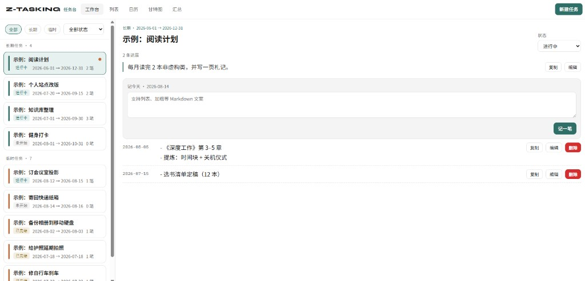
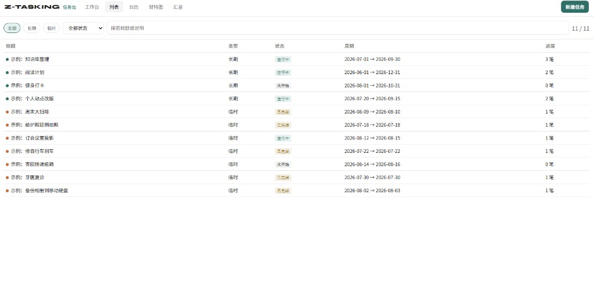
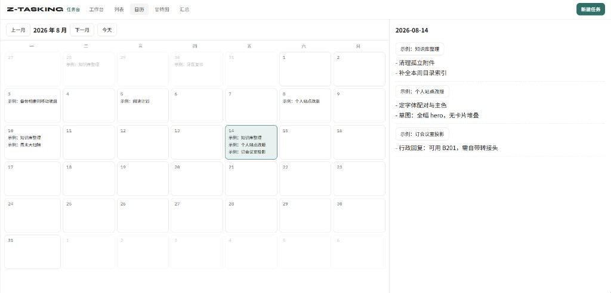
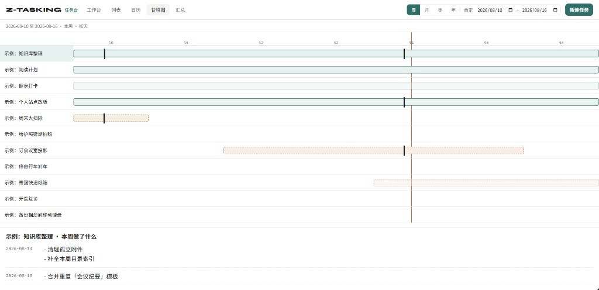
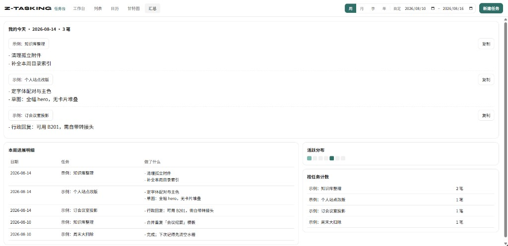

# Z-Tasking

Obsidian 插件：长期 / 临时任务台。每个任务是一篇 Markdown 笔记，支持工作台记进展、全量列表、日历、甘特图和周期汇总。

插件 id：`z-tasking`（避免与社区里其他 tasking 插件冲突）

## 笔记结构

```text
z-tasking/
  长期/
    某长期事项.md
  临时/
    某临时任务.md
```

```markdown
---
type: long
status: doing
start: 2026-08-10
end: 2026-09-30
---

任务说明。

## 进展

### [[2026-08-13]]
今天做了什么。支持 **Markdown**、列表和 `[[双向链接]]`。
```

根目录可在设置里改，默认 `z-tasking`。

## 本地开发

```bash
npm install
npm run dev
```

把本仓库复制或 junction 到：

```text
<Vault>/.obsidian/plugins/z-tasking/
```

需要这三个文件被 Obsidian 读到：

- `manifest.json`
- `main.js`（`npm run build` 或 `npm run dev` 生成）
- `styles.css`

然后在 Obsidian：设置 → 第三方插件 → 启用 **Z-Tasking**。命令面板：`Z-Tasking: 打开任务台`。

## 界面预览

截图来自交互原型（Mock 数据），与 Obsidian 内实际插件界面一致。

| 工作台 | 列表 |
| --- | --- |
|  |  |

| 日历 | 甘特图 |
| --- | --- |
|  |  |



## 界面原型预览

`prototype/index.html` 是纯前端交互原型（内置 **Mock 数据**），**不是**插件运行时依赖，也不会读写你的 vault。

### 最快：直接打开

1. 在资源管理器中进入本仓库的 `prototype` 目录  
2. 双击 `index.html`，用系统默认浏览器打开  

或在浏览器地址栏打开本地 `file://` 路径（把盘符与目录换成你本机位置）：

```text
file:///C:/path/to/obsidian-plugin-ztasking/prototype/index.html
```

### 用本地静态服务（可选）

若浏览器对 `file://` 限制剪贴板等 API，可在仓库根目录执行：

```bash
npx --yes serve prototype -p 5173
```

浏览器访问：http://localhost:5173

### 在 Cursor / VS Code 里

安装 **Live Server**（或同类）扩展 → 右键 `prototype/index.html` → **Open with Live Server**。

### 原型里能看什么

工作台 / 列表 / 日历 / 甘特图 / 汇总；周月季年 + 自定时间范围；说明与进展的编辑/复制；侧边栏上限与点选不插队等。数据均为虚构示例，改完刷新页面即可。

---

## 发布到社区插件

按 [官方流程](https://docs.obsidian.md/Plugins/Releasing/Submit+your+plugin)：

1. `npm run build`
2. `manifest.json` 的 `id` 保持 `z-tasking`，且社区列表中未被占用
3. GitHub Release 的 tag 与 `manifest.json` 的 `version` 一致（如 `0.1.0`）
4. Release 附件上传 `main.js`、`manifest.json`、`styles.css`
5. 向 `obsidianmd/obsidian-releases` 提交 PR，追加插件条目
